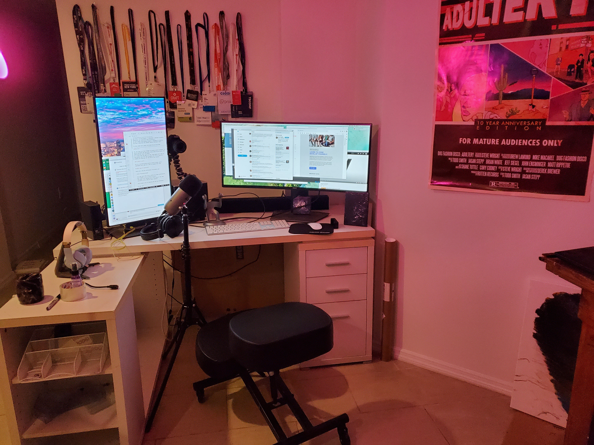

# video-notes

I took a week off in August 2020 to set up my office for high quality video recording and streaming. 

- Day 1 - [Room layout and editing](./day1.md)
- Day 2 - [Editing & Audio v1](./day2.md)
- Day 3 - [Framing and sound](./day3.md)
- Day 4 - [Streaming setup](./day4.md)
- Day 5 - [Higher Fidelity](./day5.md)

## My Setup

#### Hardware

- Camera: [Canon EOS 250D (rebel 3)](https://www.bhphotovideo.com/c/product/1473087-REG/canon_3453c002_eos_rebel_sl3_dslr.html)
- Cam tripod: [Gorilla Pod](https://joby.com/us-en/gorillapod-3k-stand-jb01510-bww/)
- Cam input: [Cam Link 4k](https://www.elgato.com/en/gaming/cam-link-4k) / [Cascable Pro Webcam](https://cascable.se)
- Mic: [Blue Yeti](https://www.bluemic.com/en-us/products/yeti/) (gain 1/3rd, using the upside-down heart pattern)
- Mic tripod: some old thing laying around the house
- Lighting FG: [Philips Hue](https://www.philips-hue.com/en-us) in a full-length lamp with movable head
- Lighting BG: Random $5 light bulbs from a hardware store

#### Software

- Recording: Screenflow 9 (see [Higher Fidelity](./day5.md) for more)
- Editing: Screenflow 9
- Streaming: Twitch Studio

#### Looks like

