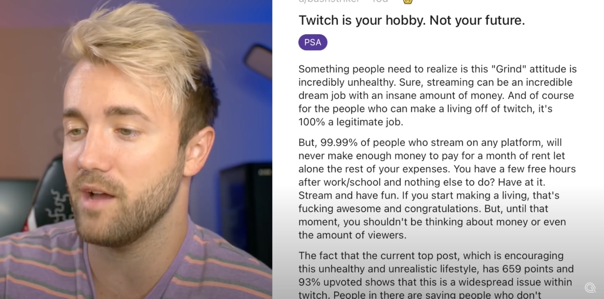

Spent some time studying how [Alpha Gaming](https://www.youtube.com/watch?v=1HomrJxmBCk&t=284s) lights and edits his videos:

### Editing

- All cuts have ~0.5s of audio first before the video cuts
- Cute title card
  

- Uses a 50/50 horizontal split for showing some other content
  

- Uses a small inlay cut for full web pages when needed
  

- Uses a _really_ strong setting for the BG colours:
  
  I assume this is done to make him pop out more

### Mic

I've put a rug in my office, and added some sofa cushions behind the computer to attack the tinny/echo
