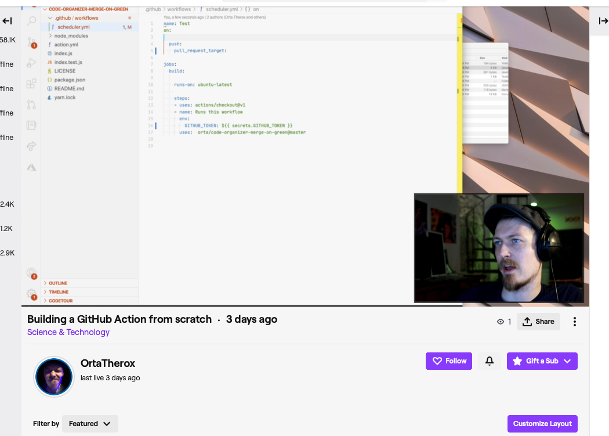
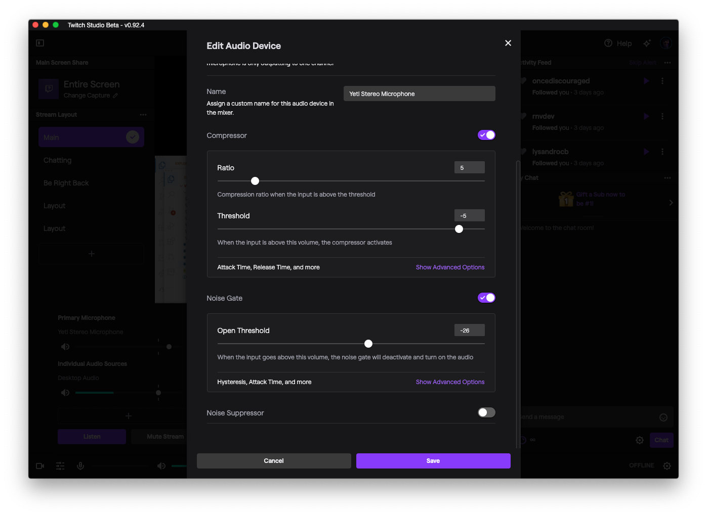

## Day 4: Streaming

I set about looking at a streaming setup with Twitch Studio

I focused more on getting the white balance set up between me and the BG, Cascable was a bit unreliable on a long stream, so I switched over to using the el-gato HDMI input for recording. Given that most of the time the video input was a small box in the corner, raw fidelity wasn't that important.

I bought some red/green lightbulbs from a hardware store, and used that in the BG, and took the Hue lamp to be used as for face focus. The mic is on a stand which lives just off the desk, it doesn't have to be too close. 

After making a tester video with different gain settings, I've come to the conclusion that gain at about 1/3rds full (close to almost pointing at the "G" in gain) is the right setting. 

Twitch studio has a good compressor and audio settings, after 30m of playing around this felt right:

