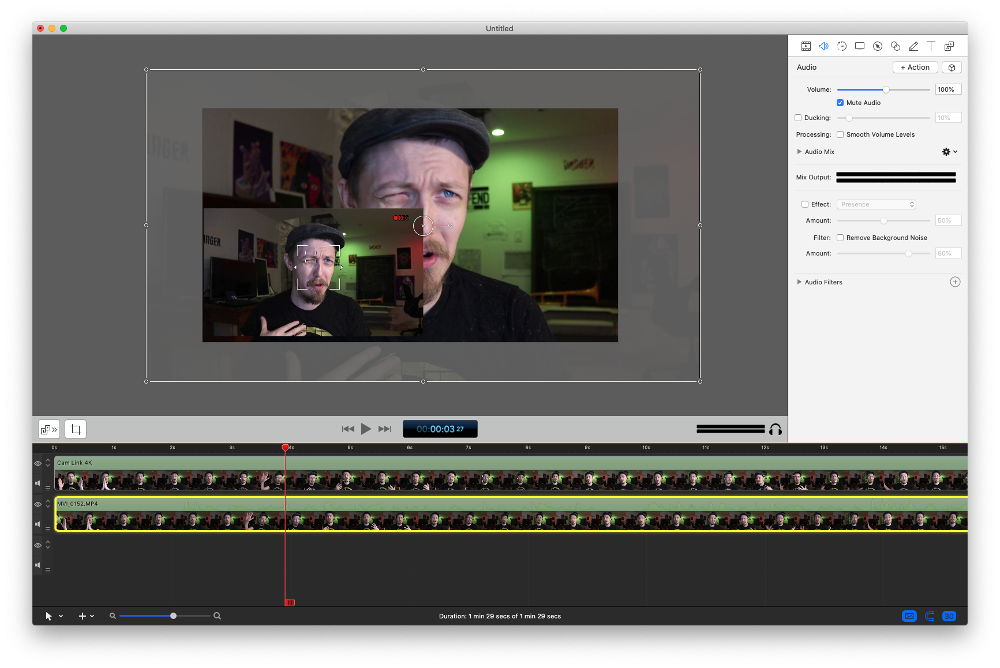
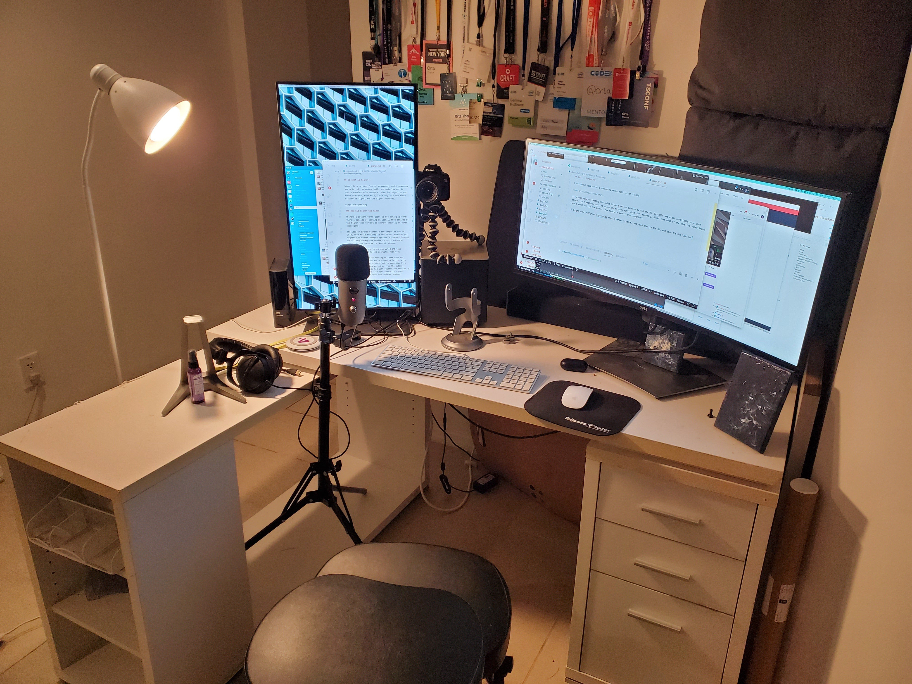

## Upping the Recording Fidelity

I came back with the improvements from streaming to bring them back to video editing. 

I tested recording video via:

 - Cascable (max 720p)
 - HDMI input (also 720p somehow, and can't have auto-focus on)
 - Pressing the damn record button

You'd probably not be shocked to learn pressing the record button was the best option.

---

So here's my route for recording:

I get everything ready, then hit the record button. Then I record in screenflow using the HDMI output to show to the video. Then I import the video from the camera's SD card and put them together on the timeline:

This setup is high enough quality, I was surpised to find that the Mic didn't really pick up on my wife listening to the beatles in the background. In previous recording sessions, I would ask the house for silence for 2 hours, but I think the gain was probably too high on the Mic.

This is what my desk setup looks like now for recording:

The camera is next to notes on the left screen, the right one I switch to figma/sketch and choose a colour for the whole screen to add some variety in colour.

